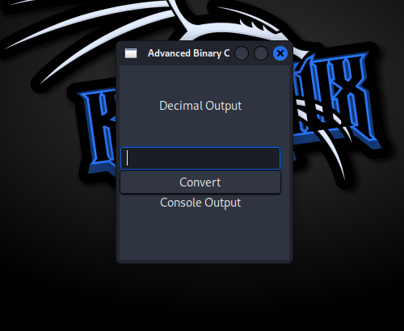

# Binary Converter

Binary Converter is a C-based application using GTK for creating a graphical user interface (GUI) to convert binary numbers into their decimal equivalents. This advanced converter is built by **ALmax** to provide an interactive and user-friendly experience, with features such as dark mode, real-time conversion on input events, and a built-in console for process logs.

## Features

- **Dark Theme**: The application comes with a sleek dark theme to reduce eye strain and provide a modern interface.
- **Binary-to-Decimal Conversion**: Input binary numbers (0s and 1s) and instantly convert them to decimal format.
- **Input Validation**: Only binary numbers (0 and 1) are accepted in the input field to ensure accuracy.
- **Interactive UI Elements**:
  - **Decimal Output Area**: A highlighted square area to display the conversion results.
  - **Convert Button**: Manual conversion option for binary-to-decimal conversion.
  - **Process Console**: A console at the bottom of the app to display the process, logs, and any errors.

## Screenshots



## Installation

### Requirements
- GCC (GNU Compiler Collection)
- GTK+ 3.0
- A Linux distribution (developed and tested on Kali Linux)

### Steps to Run

1. Clone the repository:
   ```bash
   git clone https://github.com/ALmax-git/binary_converter.git
   ```

2. Navigate to the project directory:
   ```bash
   cd binary_converter
   ```

3. Compile the program:
   ```bash
   gcc `pkg-config --cflags gtk+-3.0` -o bin_converter_v2 bin_converter_v2.c `pkg-config --libs gtk+-3.0`
   ```

4. Run the application:
   ```bash
   ./bin_converter_v2
   ```

## How It Works

- Enter a binary number (e.g., 1011) into the input field.
- The decimal equivalent is displayed in the output area.
- A console below logs the conversion process and any errors.
- The convert button can be used for manual conversion.

## Project Structure

```
.
├── bin_converter_v2.c   # Main C source file
├── README.md            # Project documentation
└── screenshot.png       # App screenshot (to be added)
```

## Contributing

We welcome contributions! If you’d like to contribute:
- Fork this repository
- Make your changes
- Submit a pull request

## License

This project is licensed under the MIT License. See the [LICENSE](LICENSE) file for more details.

---

Made with ❤️ by **ALmax** and **Others** for the C programming and GTK GUI community. Let's make **ALmax-git** a better place for learners! 🎉

